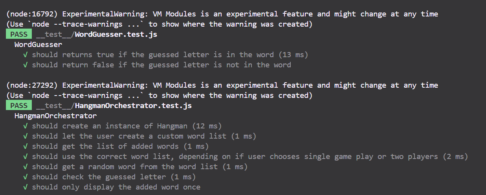
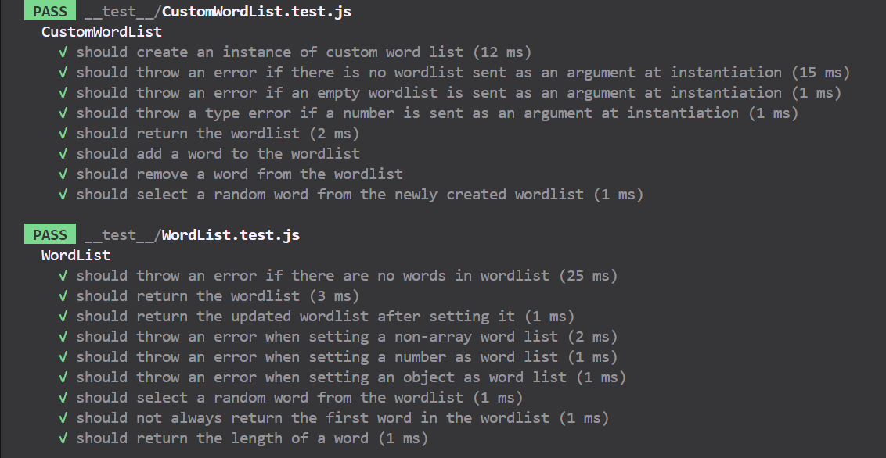
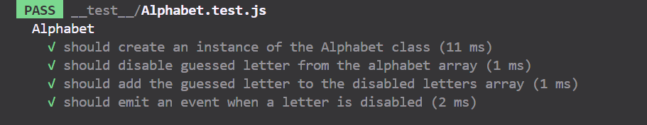

# Hangman Game (A1 part 2)

## Authors

Beatriz Sanssi <bs222eh@student.lnu.se>
Sabrina Prichard-Lybeck <sp223kz@student.lnu.se>

## About

This project is a Hangman Game that has been developed using TDD (Test-Driven Development) for a course in Software Development at Linneaus University.

Hangman Game gives the user a choice to play the game as one-player or two-players. If the user chooses to play a one-player game, the game will use a default word list. If the user chooses to play a two-player game, the user will be presented with a choice to input custom words to a custom word list.

## How to start the game

Start the game with `npm run dev` and the game will start on `localhost:5173`

## Testing

Hangman Game has been tested using mainly automated unit testing (with Jest and 'jsdom' testing environment), mocking and some manual testing in the browser (localhost).

To run the automated unit tests, use `npm run test`

### Tests

### Current test coverage

## Known bugs/issues to be fixed

* If the player guesses on a letter that has already been guessed, the player can keep guessing without the game progressing any further (and visual feedback on the letters that have already been guessed has not yet been implemented).

* The two-player game isn't yet functional, needs bugfix before it can be played.